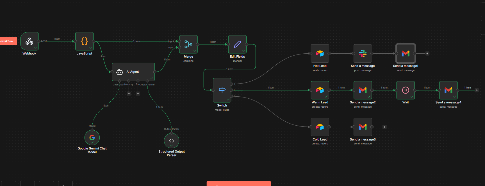
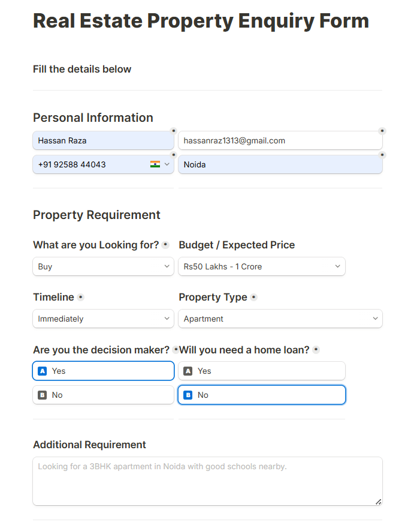
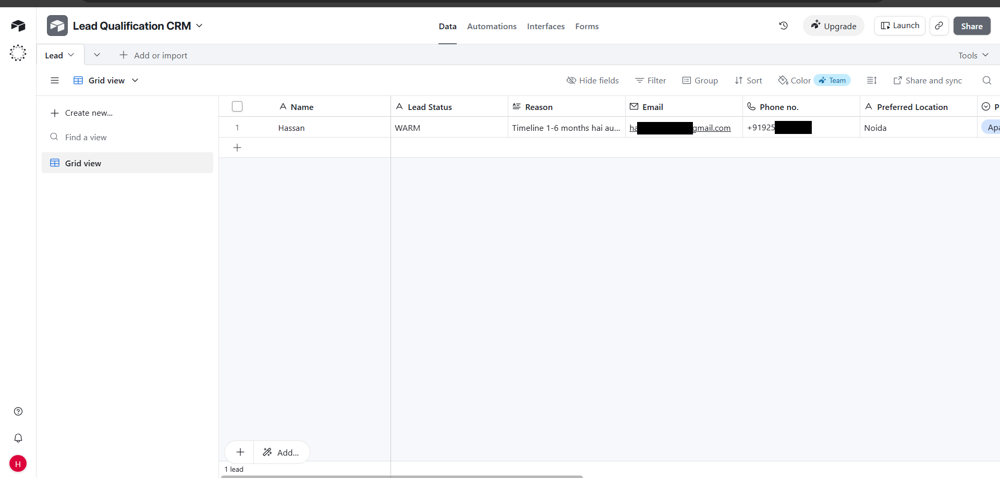

# Real Estate Lead Qualification

An automated lead qualification and routing system built with **n8n**, **AI (Google Gemini)**, and **Airtable**. This workflow captures leads from a web form, uses AI to score their intent, and automatically routes them into Hot, Warm, or Cold pipelines — each with tailored CRM updates and email/Slack follow-ups.

## Overview

Manually qualifying and following up with every real estate lead is slow and inconsistent. This workflow automates the entire process end-to-end:

1. A lead submits a form (name, phone, email, budget, timeline, property interest, etc.)
2. An AI agent analyzes the lead's intent, urgency, and decision-making signals
3. The lead is automatically classified as **Hot**, **Warm**, or **Cold**
4. Based on the classification, the lead is saved to Airtable and receives a personalized, automated response

## How it works

```
Webhook → Format Data → AI Qualification → Switch (Hot / Warm / Cold)
```

### 🔥 Hot Lead
High intent, ready to move within 30 days, and is the decision maker.
- Record created in Airtable
- Instant Slack alert sent to the sales team
- Personalized email sent to the lead confirming a callback

### ☀️ Warm Lead
Interested, but timeline is 1–6 months, or not the sole decision maker yet.
- Record created in Airtable
- Informational email sent to the lead
- Wait period, then an automated follow-up email checking back in

### ❄️ Cold Lead
Timeline is beyond 6 months or "just exploring" — low urgency.
- Record created in Airtable
- Low-pressure "nurture" email sent, keeping the door open for future contact

## Tech stack

| Component | Tool |
|---|---|
| Workflow automation | [n8n](https://n8n.io) |
| AI qualification | Google Gemini (Chat Model) |
| Lead scoring logic | AI Agent + Structured Output Parser |
| CRM / storage | Airtable |
| Team notifications | Slack |
| Email automation | Gmail |

## Workflow diagram

```
Webhook
  │
  ▼
Format Data (JavaScript)
  │
  ▼
AI Agent (Gemini + Structured Output Parser)
  │
  ▼
Switch (routes by lead score)
  │
  ├── Hot Lead  → Airtable → Slack alert → Email (customer)
  ├── Warm Lead → Airtable → Email → Wait → Follow-up email
  └── Cold Lead → Airtable → Nurture email
```

## Lead scoring logic

The AI agent classifies each lead using a scoring matrix based on timeline and decision-making authority:

- **Hot** — timeline is "Immediately" or "Within 30 days" AND the person is the decision maker
- **Warm** — timeline is "1–6 months", or short timeline but not the decision maker, or needs a home loan with a slightly delayed timeline
- **Cold** — timeline is "After 6 months" or "Just exploring", regardless of budget

## Project Highlights

- AI-based lead qualification using Google Gemini
- Automatic Hot / Warm / Cold lead classification
- Airtable CRM integration
- Slack notifications for Hot leads
- Automated Gmail responses
- Follow-up automation for Warm leads
- Built using n8n

```json
{
  "Full Name": "Hassan Raza",
  "Email": "hassan@example.com",
  "Phone no": "+919087976789",
  "What are you Looking for?": "Buy",
  "Timeline": "Within 30 days",
  "Preferred Location": "Noida",
  "Property Type": "Apartment",
  "Budget / Expected Price": "Rs50 Lakhs - 1 Crore",
  "Are you the decision maker?": "Yes",
  "Will you need a home loan?": "No"
}
```

## Screenshots

## Screenshots

### Workflow



### Lead Capture Form



### Airtable CRM




## Notes

- This is a demo/portfolio project. For production/client use, credentials (Gmail, Slack) should be connected using the client's own accounts, not the developer's.
- The `Wait` node requires the workflow to be **published (active)** and the n8n instance to stay running for the full wait duration.
- Each form submission triggers an independent execution — concurrent leads are processed in parallel and do not block one another.
- The uploaded `workflow.json` should have Airtable base/table IDs, Slack channel IDs, and credential references sanitized/removed before publishing publicly.

## Future improvements

- [ ] Deduplication check before creating new Airtable records
- [ ] SLA timer + escalation for unresponded Hot leads
- [ ] Calendar booking link (Calendly) in Hot lead email
- [ ] Analytics dashboard tracking response times and conversion rates
- [ ] Error handling / fallback path for failed AI qualification

## Author

## Author

**Hassan Raza**

Freelance AI Automation Developer (Learning & Building with n8n, AI Agents, and Workflow Automation)

LinkedIn: https://linkedin.com/in/in/hassan-raza-1a8806418/
