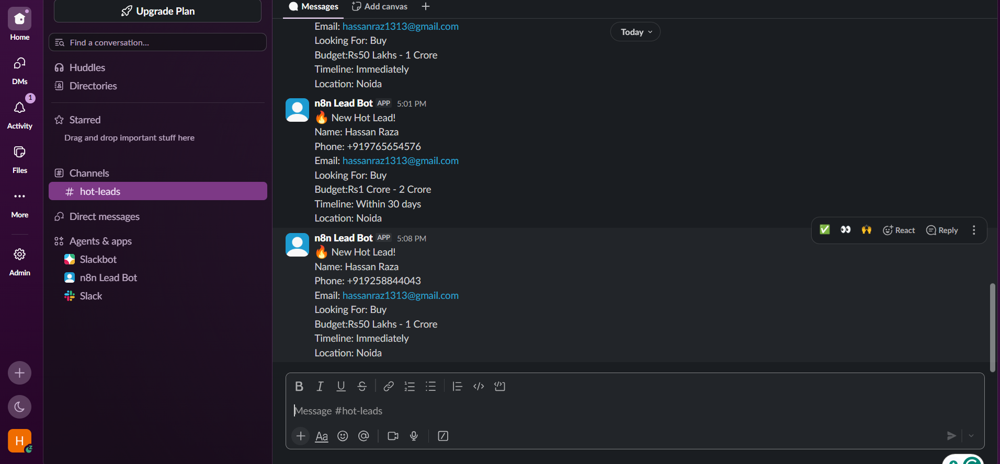
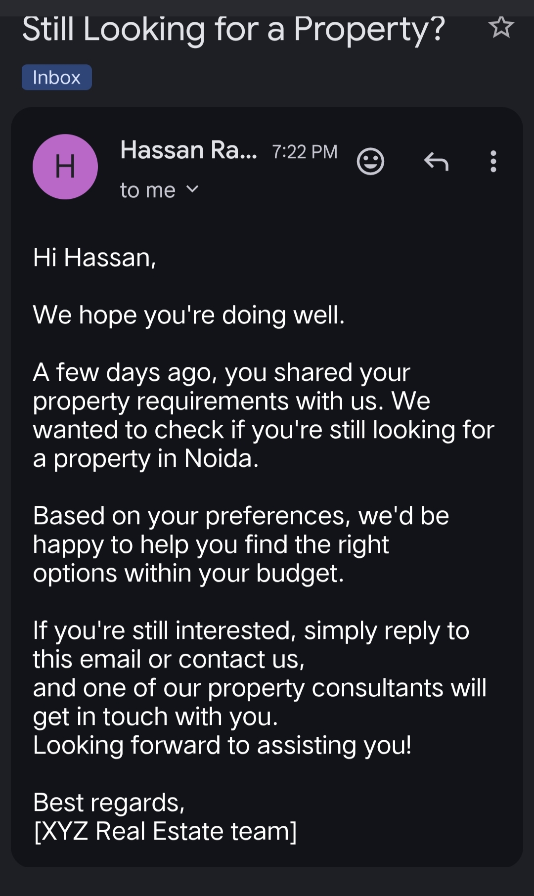

# AI-Powered Real Estate Lead Qualification System

An end-to-end AI-powered lead qualification workflow built with **n8n**, **Google Gemini**, **Airtable**, **Slack**, and **Gmail**.

The workflow automatically analyzes incoming real estate leads, classifies them into **Hot**, **Warm**, or **Cold**, stores them in Airtable CRM, sends team notifications, and automates customer email communication.

---

# Overview

Real estate businesses receive many inquiries every day, but manually reviewing every lead is time-consuming and inconsistent.

This workflow automates the complete process from lead capture to qualification and follow-up.

### Process

1. Customer submits a lead form
2. Lead data is formatted
3. Google Gemini AI analyzes the lead
4. AI classifies the lead as:
   - Hot
   - Warm
   - Cold
5. Lead is saved in Airtable CRM
6. Notifications and emails are automatically sent based on lead quality

---

# Project Highlights

- AI-powered lead qualification using Google Gemini
- Automatic Hot / Warm / Cold lead classification
- Airtable CRM integration
- Slack notifications for Hot leads
- Automated Gmail responses
- Automatic follow-up emails for Warm leads
- End-to-end workflow built in n8n

---

# Workflow Architecture

```
Webhook
    │
    ▼
JavaScript (Format Data)
    │
    ▼
Google Gemini AI Agent
    │
    ▼
Structured Output Parser
    │
    ▼
Switch
 ├── Hot Lead
 │      │
 │      ├── Airtable
 │      ├── Slack Notification
 │      └── Welcome Email
 │
 ├── Warm Lead
 │      │
 │      ├── Airtable
 │      ├── Welcome Email
 │      ├── Wait 3 Days
 │      └── Follow-up Email
 │
 └── Cold Lead
        │
        ├── Airtable
        └── Nurture Email
```

---

# Lead Qualification Logic

## Hot Lead

- Timeline: Immediately / Within 30 Days
- Decision Maker: Yes
- High purchase intent

Actions:

- Save to Airtable
- Slack notification
- Immediate email

---

## Warm Lead

- Timeline: 1–6 Months
- Moderate buying intent
- May require more nurturing

Actions:

- Save to Airtable
- Welcome email
- Wait 3 days
- Follow-up email

---

## Cold Lead

- Timeline: After 6 Months
- Just exploring
- Low urgency

Actions:

- Save to Airtable
- Nurture email

---

# Tech Stack

| Category | Tool |
|----------|------|
| Workflow Automation | n8n |
| AI Model | Google Gemini |
| AI Processing | AI Agent + Structured Output Parser |
| CRM | Airtable |
| Notifications | Slack |
| Email Automation | Gmail |

---

# Screenshots

## Workflow


---

## Lead Capture Form


---

## Airtable CRM


---

## Slack Notification



---

## Initial Email


---

## Follow-up Email



---

# Files Included

- README.md
- workflow.json
- workflow.png
- form.png
- airtable.png
- slack.png
- email-output.jpg
- Email-follow-up.jpg

---

# Notes

This is a portfolio/demo project created to demonstrate AI-powered workflow automation using n8n.

---

Author

## Hassan Raza

I'm currently learning and building practical AI Automation projects using:

- n8n
- AI Agents
- Google Gemini
- APIs
- Airtable
- Slack
- Gmail Automation

I'm continuously improving my skills by building real-world automation projects.

Feedback and suggestions are always welcome.
