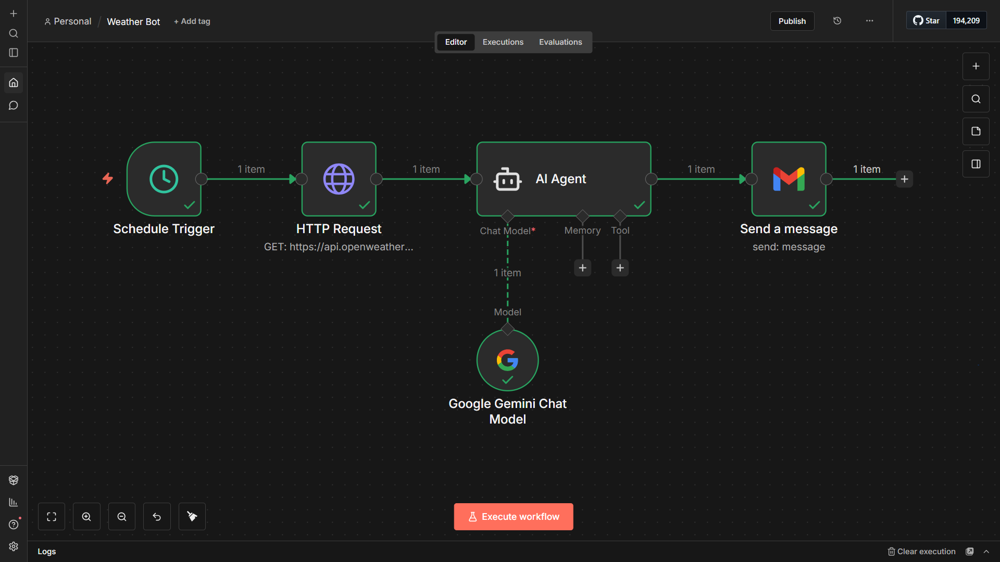
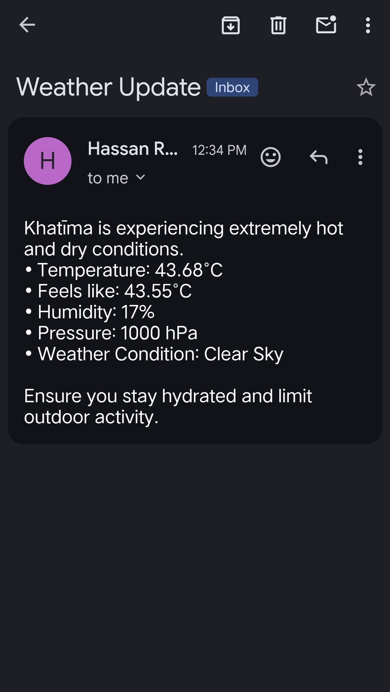

# 🌦️ AI Weather Bot

An AI-powered weather automation workflow built with n8n.

This workflow automatically fetches live weather data from OpenWeatherMap every 12 hours, uses Gemini 2.5 Flash to convert raw weather data into a clean and readable report, and sends the report to Gmail.

---

## Features

- ⏰ Runs automatically every 12 hours
- 🌍 Fetches live weather data using OpenWeatherMap API
- 🤖 Generates a professional weather summary with Gemini 2.5 Flash
- 📧 Sends the weather report directly to Gmail
- 📝 Fully automated workflow built in n8n

---

## 🛠 Tech Stack

- n8n
- OpenWeatherMap API
- Google Gemini 2.5 Flash
- Gmail

---

## 🔄 Workflow

Schedule Trigger  
⬇  
HTTP Request (OpenWeatherMap API)  
⬇  
AI Agent (Gemini 2.5 Flash)  
⬇  
Gmail

---

## 📷 Workflow Screenshot

---

## 📧 Output

---

## 🎯 Purpose

This project demonstrates how APIs, AI, and workflow automation can be combined to generate and deliver useful information automatically.
